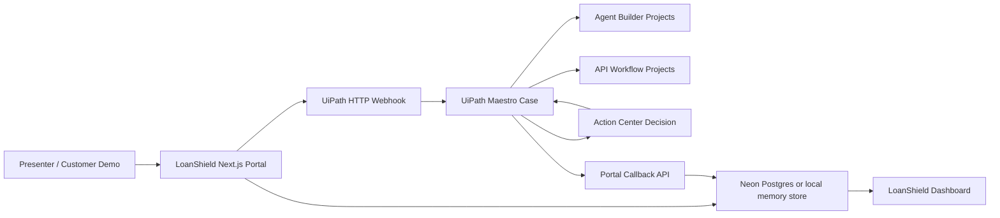

# LoanShield Agent Hack Final

LoanShield is a hackathon demo that shows how a loan dispute can move from a customer-facing web portal into a UiPath Maestro Case, pause for a human Action Center decision, then complete settlement, customer communication, and audit closure with live status callbacks.

The repository is intentionally split into two parts:

```text
web-app/
  Next.js LoanShield portal, API routes, Neon-backed case data, webhook sender, and UiPath callback receiver.

uipath-maestro/
  UiPath Maestro Case source, Agent Builder projects, and API workflow projects used by the orchestration demo.
```

## Elevator Pitch

LoanShield uses UiPath Maestro, AI agents, Action Center, and a live web portal to resolve loan disputes end to end with evidence triage, human approval, notifications, and case updates.

## Built With Codex

This hackathon project was designed, implemented, tested, documented, and packaged with the help of OpenAI Codex as the coding and automation build partner.

The UiPath automation side was also built and validated with UiPath coding agents and the UiPath CLI for authoring, packaging, publishing, deploying, and testing the Maestro Case, Agent Builder projects, and API workflow projects.

## What The Demo Shows

Loan disputes often require several teams to coordinate: intake, loan context lookup, policy triage, evidence review, servicing investigation, fraud checks, human approval, settlement, customer communication, and audit closure. LoanShield turns that messy workflow into a visible case journey.

1. A dispute is created in the LoanShield web portal.
2. The portal stores the case and sends a secured webhook to UiPath.
3. UiPath Maestro starts a Case Management flow.
4. Sequential stages build context in order.
5. Evidence and servicing/fraud investigations run in parallel.
6. Action Center pauses the case for a human Yes/No approval.
7. The approved case continues to settlement, customer communication, and closure.
8. UiPath posts status updates back to the portal.
9. The portal dashboard shows stage, actor, evidence, timeline, and final outcome.

## Live Demo

- Portal: https://agenthack-loandispute.vercel.app
- Health check: https://agenthack-loandispute.vercel.app/api/health
- Demo case key used by the UiPath hardcoded path: `LoanShieldDemoPortal:LDS-20260628-0001`

The live portal is protected for demo use. The source in this repo documents the implementation, but secrets and generated webhook URLs have been intentionally removed.

## Verified UiPath Run

The Action Center version was deployed and tested in UiPath staging without disturbing the earlier hackathon-ready `1.0.16` version.

| Item | Value |
| --- | --- |
| UiPath environment | `https://staging.uipath.com` |
| Organization | `aifanatic` |
| Tenant | `DefaultTenant` |
| Tested package | `LoanShieldMaestroVercelIsolated` |
| Tested version | `1.0.22` |
| Tested deployment | `LoanShieldMaestro-ActionCenter-122` |
| Tested folder | `Shared/CreditFlowCase-Staging-ActionCenter-122` |
| Successful case instance | `f4d717ff-45b8-49d7-a8f7-c20bf9c64351` |
| Action Center task | `100207230` |
| Human decision | `ProceedFurther` |
| Final case status | `Completed` |
| Incidents | `0` |
| Completed time | `2026-06-29T18:57:20Z` |

Important Action Center note: the successful demo path is to click the `Yes / ProceedFurther` action and submit no custom result fields. The case source contains the Action Center gate and the prior-stage context payload shown to the reviewer.

## Architecture



## Repository Guide

| Path | Purpose |
| --- | --- |
| `web-app/app` | Next.js App Router pages and API routes. |
| `web-app/components` | Dashboard, timeline, stage stepper, forms, badges, and UI primitives. |
| `web-app/lib` | Dispute service, store abstraction, auth helpers, UiPath webhook client, validators, and demo scenarios. |
| `web-app/db` | Drizzle schema and SQL migration. |
| `web-app/scripts` | Seed and smoke-test scripts. |
| `uipath-maestro/case-management/LoanShieldMaestroCase` | Main Maestro Case plan source and generated BPMN representation. |
| `uipath-maestro/agent-projects` | Low-code Agent Builder project source used by the stages. |
| `uipath-maestro/api-workflows` | API workflow source projects used for webhook intake, portal callbacks, mock servicing APIs, email, sheets, and audit events. |

## UiPath Case Story

The main case is `LoanShieldMaestroCase`.

Primary case stages:

1. `Demo Intake`
2. `Loan Context Retrieval`
3. `Eligibility and Policy Triage`
4. `Evidence Collection`
5. `Parallel Servicing / Fraud Investigation`
6. `Human Decision`
7. `Settlement and Correction`
8. `Customer Communication`
9. `Closure and Audit QA`

The case has both a manual demo start and an HTTP webhook start. For hackathon reliability, it also includes hardcoded demo payloads so the story can be run even when the external trigger is not being exercised live.

## UiPath Projects Included

Agent Builder projects:

- `AuditQAAgent`
- `CaseManagerAgent`
- `CustomerCommunicationAgent`
- `DecisionPackAgent`
- `EvidenceSufficiencyAgent`
- `FraudPatternAgent`
- `IntakeClassificationAgent`
- `LoanPolicyTriageAgent`
- `ServicingInvestigationAgent`

API workflow projects:

- `WebhookIntake_CreateOrCorrelateCase`
- `NextPortal_GetCaseContext`
- `NextPortal_SyncCaseUpdate`
- `Audit_WriteCaseEvent`
- `Compliance_CreateReferralMock`
- `CustomerComms_SendMessageMock`
- `FraudOps_CreateFraudHoldMock`
- `LoanServicing_DetectDuplicateOrMisappliedPaymentMock`
- `LoanServicing_PostCorrectionMock`
- `LoanServicing_RetrieveCustomerProfileMock`
- `LoanServicing_RetrievePaymentHistoryMock`

## Web App Setup

From the repository root:

```bash
cd web-app
npm install
cp .env.example .env.local
npm run dev
```

Open `http://localhost:3000`.

Default local demo login:

```text
username: demo
password: demo123
```

For a reliable deployed demo, configure a Neon/Postgres database and the UiPath callback/webhook secrets in the hosting environment.

## Web App Environment Variables

| Variable | Required For | Notes |
| --- | --- | --- |
| `NEXT_PUBLIC_APP_URL` | Hosted callbacks and generated links | Set to the public Vercel URL. |
| `DATABASE_URL` | Persistent data | Optional locally because the app can fall back to an in-memory store. |
| `UIPATH_WEBHOOK_URL` | Portal-to-UiPath trigger | Generated by UiPath HTTP Webhook connection. Do not commit the live URL. |
| `UIPATH_WEBHOOK_API_KEY` | Portal-to-UiPath trigger auth | Sent as `x-demo-webhook-key`. |
| `UIPATH_CALLBACK_API_KEY` | UiPath-to-portal callbacks | Required by `/api/uipath/case-updates` and `/api/uipath/case-context`. |
| `DEMO_USERNAME` / `DEMO_PASSWORD` | Demo login | Change for shared environments. |
| `DEMO_SESSION_TOKEN` | Demo auth cookie | Use a long random value in hosted environments. |
| `DEMO_ADMIN_TOKEN` | Reset endpoint | Required only when `ENABLE_DEV_RESET=true`. |

## UiPath Setup Notes

The public source has been sanitized:

- Generated UiPath webhook URL is replaced with `<UIPATH_GENERATED_WEBHOOK_URL>`.
- Personal demo email bindings are replaced with placeholder addresses.
- Runtime deployment configs, user profiles, generated package zips, and nupkg files are not included.

To run from this source in a new UiPath environment:

1. Import or recreate the API workflow projects from `uipath-maestro/api-workflows`.
2. Import or recreate the Agent Builder projects from `uipath-maestro/agent-projects`.
3. Import the Maestro case from `uipath-maestro/case-management/LoanShieldMaestroCase`.
4. Bind the process references in the case to your deployed API workflows and agents.
5. Create Integration Service connections for HTTP Webhook, Gmail, and Google Sheets if you want the full demo.
6. Update the portal environment variables with the generated UiPath webhook URL and callback key.
7. Run the case manually first, then test the webhook-triggered path.

## Demo Walkthrough For Judges

1. Open the LoanShield portal and show a loan dispute with stage cards and a timeline.
2. Explain that the portal stores the dispute and sends a secure webhook to UiPath.
3. Open UiPath Studio Web and show the `LoanShieldMaestroCase` case plan.
4. Point out the sequential stages, then the parallel investigation section.
5. Start or show a case run reaching `Human Decision`.
6. Open the Action Center task titled `Review LoanShield evidence and approve proceed?`.
7. Show the trigger information and prior-stage evidence summary.
8. Click `Yes / ProceedFurther`.
9. Show the case moving into settlement, communication, and closure.
10. Return to the portal and show stage/timeline updates.

## Validation Commands

Useful local web-app checks:

```bash
cd web-app
npm run lint
npm run smoke
```

UiPath checks used during the tested build included:

```bash
uip api-workflow validate NextPortal_SyncCaseUpdate/Workflow.json --output json
uip maestro case pack LoanShieldMaestroCase dist-case-1.0.22 --name LoanShieldMaestroCase --version 1.0.22 --output json
uip solution publish LoanShieldMaestroVercelIsolated_1.0.22.zip --wait --output json
uip solution deploy run --name LoanShieldMaestro-ActionCenter-122 --package-version 1.0.22 ...
```

## Public Repository Hygiene

This repository intentionally excludes:

- `.env.local` and all real secrets.
- `.next`, `.vercel`, `node_modules`, logs, and local build output.
- UiPath generated deployment configs and historical debug folders.
- UiPath package archives such as `.zip`, `.uipx`, and `.nupkg`.
- User profile overrides and temporary package extraction folders.

## Hackathon Summary

LoanShield demonstrates a complete AI-orchestrated business process rather than a single chatbot or isolated automation. The portal gives judges a business-facing experience, while UiPath Maestro shows the operational control plane: structured case stages, AI agents, API workflows, parallel work, Action Center approval, notifications, audit logging, and final closure.
